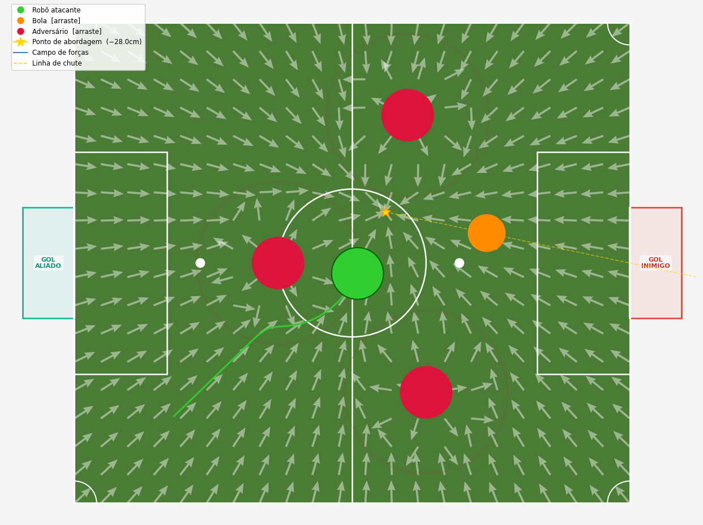

# Campos Potenciais Artificiais — VSSS

Simulação do método **Artificial Potential Field (APF)** aplicado ao futebol de robôs IEEE Very Small Size Soccer (VSSS).

O robô navega de forma reativa (SENSE-ACT): a cada passo lê as posições e segue o vetor resultante do campo potencial, sem planejamento de rota.



## Dependências

```bash
pip install numpy matplotlib
```

## Como executar

```bash
python campos_potenciais.py
```

## Interação

- **Arrastar** a bola (laranja) ou os adversários (vermelho) com o mouse recalcula o campo em tempo real.
- **R** - reinicia o robô na posição inicial.

